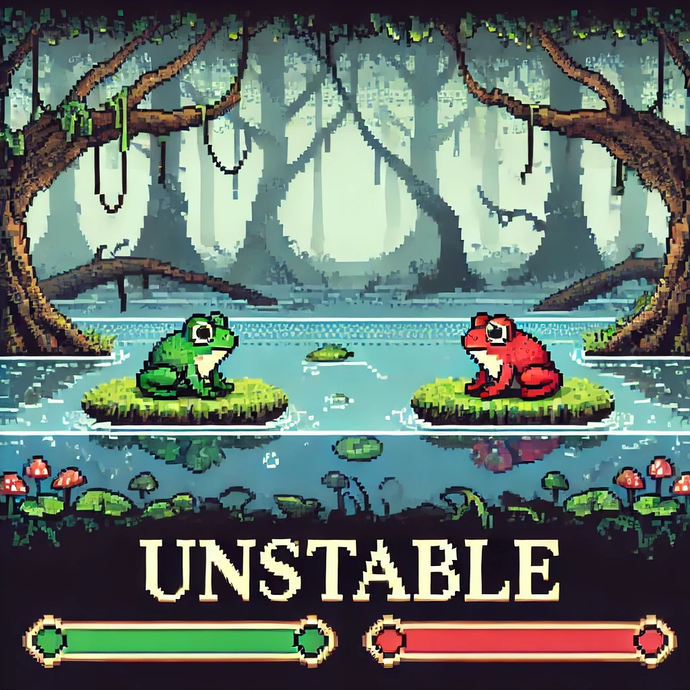
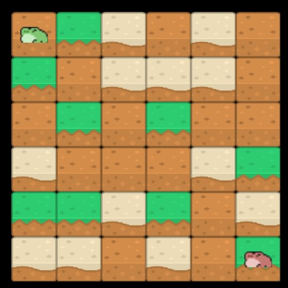

# 🌀 Unstable  

  

*Unstable* es un juego arcade por turnos inspirado en BLOKI. Se basa en plataformas que solo pueden tocarse un número limitado de veces antes de destruirse. Una vez que desaparecen, dejan un vacío en el que caer significará la derrota.  

💥 *Tu objetivo*: hacer que tu enemigo caiga al abismo antes que tú. ¿Serás capaz de lograrlo?  

---

## 🎮 Jugabilidad  

  

En Unstable, controlas al *sapito 🐸 verde* usando las teclas *WASD. Para ganar, debes hacer que el **sapito 🐸 rojo* caiga al vacío y así convertirte en el *rey del pantano*. 👑  

🏆 ¡Demuestra tu estrategia y conviértete en el último en pie